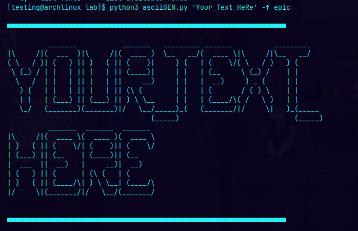
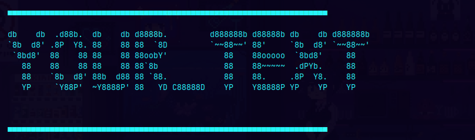

# My Ascii Banner Generator

This script generates ASCII banners using the `pyfiglet` package.

## Requirements

- Requires the `pyfiglet` package.

### Installation

#### @ Arch Linux:

sudo pacman -S python-pyfiglet

#### @ PIP:
pip install pyfiglet
 

### Usage:
Example: python3 asciiGEN.py 'Your_Text' -f epic

